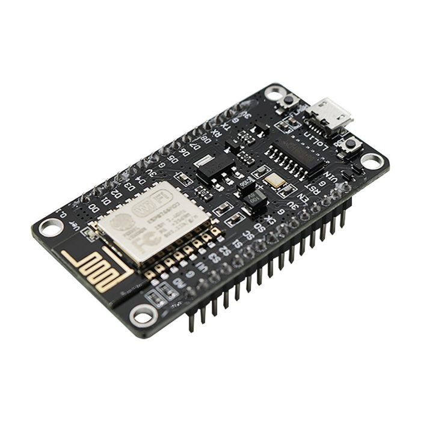
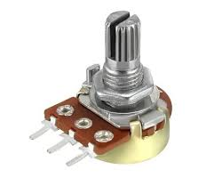
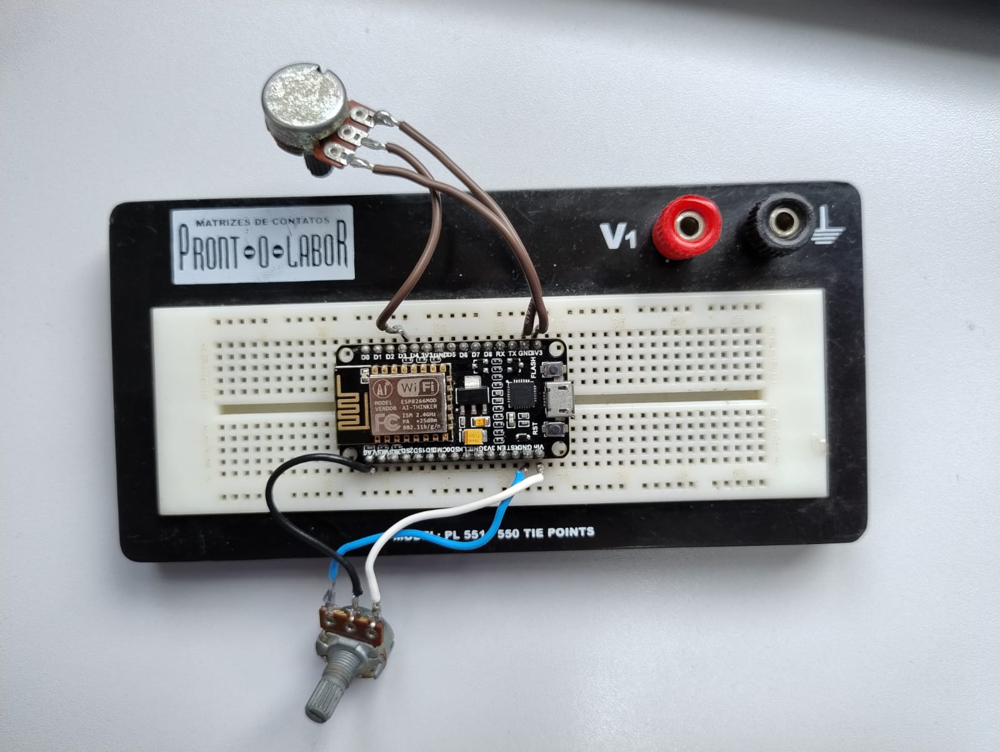

# Hardware Configuration

This documentation outlines the hardware setup for the project. The development of this prototype aimed to demonstrate the functionality of the real-world implementation. Below, we detail the components, their roles, and the prototype design used in the simulation.

## Index

1. [Components](#components)
   - [ESP8266](#esp8266)
   - [Potentiometers](#potentiometers)
2. [Prototype](#prototype)

---

## Components

### ESP8266

The ESP8266 module was utilized as the primary hardware component responsible for connecting the system to the dashboards. This module supports Wi-Fi connectivity, making it ideal for Internet of Things (IoT) applications. 

To program the ESP8266, the Arduino IDE was chosen due to its extensive support for libraries. Specifically, the Blynk library was employed to simplify the development process and establish seamless communication between the hardware and the dashboard interface.

### Potentiometers

Two 10k potentiometers were integrated into the system to simulate sensor inputs. These potentiometers provide a simple and effective way to mimic variable sensor readings, making them suitable for prototype development. By adjusting the resistance, the potentiometers emulate the behavior of real-world sensors.

---

## Prototype

The prototype designed for this project serves as a functional model to simulate the intended operation of the final product. It includes the ESP8266 module and the potentiometers, all connected to demonstrate data collection and transmission to the dashboard.

Below is an image of the prototype setup used in this project:

### Prototype Code

The code used for programming the prototype is available [here](/ESP8266_Standalone/ESP8266_Standalone.ino). Click on the link to access the `.ino` file.

---
